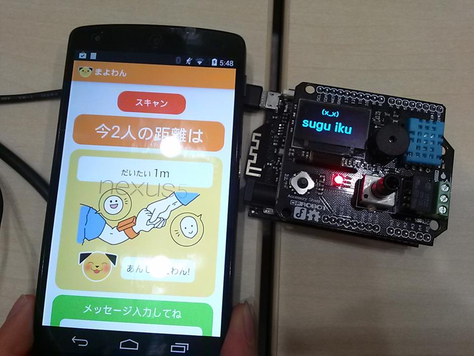

# Mayowan
### Source code for a **[hackathon](http://u.yhacks.jp/tamabi-tokyo2014/)** project, child stray protector.

Hardwares needed: **[Bluno](http://www.dfrobot.com/index.php?route=product/product&product_id=1044#.U5KkOXV515Q)** (Arduino flavor with built-in BLE shield), accessory shield for Bluno and an android phone with BLE support
It shows approximate distance between an android device and bluno using bluetooth RSSI strength. 

### Screenshot

## Usage

To use, you'll need to upload `/bluno/bluno.ino` to your Bluno, and install `/android` into your android phone.

## Necessary arduino libraries
**[U8glib](https://github.com/pabigot/u8glib)**
**[PlainProtocol](https://github.com/DFRobot/PlainProtocol)**
**[BlunoAccessory](http://www.dfrobot.com/download/BLUNO/BLUNO%20package/Accessory%20shield%20Demo%20for%20BLUNO/BLUNO/blunoAccessory.zip)**
**[Time](http://playground.arduino.cc/uploads/Code/Time.zip)**
